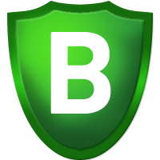
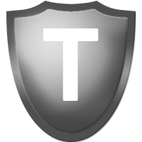

# Badges

## Uses

Badges are a tool mostly for FCs to quickly see what the fleet composition looks like and to check a pilots fitting meets requirements. Used to quickly verify information about a pilot without the need for every FC to know exactly what every pilot has on every toon they have in the whole game.

And some people like them.

To attain a badge, ask an FC and they will start the process of you getting it.

## Utility

### Elite Badge

Elite fitting or better  
AND  
Skills listed in the Elite Skills tab of the Skills page

### Shame Badge

There can be no greater heresy.

The council have decided to have you hung by your entrails and your corpse paraded through the city.

### Elite Gold Badge

Elite Badge  
AND  
Skills listed in the Elite Gold tab of the Skills page

### Bastion

Elite Badge for a Bastion-capable ship
AND
Abyssal damage modules

### Back-Channel

Pilot has access to the back comms channel on TeamSpeak.

## Roles

### Logistics Specialist

Permitted to fly Nestor Logistics.

### Missing basic skills

The player is missing some important skills.

## Fleet Commanders

### Vanguard Fleet Commander

Permitted to use TDF comms to run fleets and to take a fleet into Vanguard sites with SRP cover.

### Assault & Vanguard Fleet Commander

Permitted to use TDF comms to run fleets and to take a fleet into Assault and Vanguard sites with SRP cover.

### Headquarters, Assault & Vanguard Fleet Commander

Permitted to use TDF comms to run fleets and to take a fleet into Headquarters, Assault and Vanguard sites with SRP cover.

### Trainee Fleet Commander

Permitted to use TDF comms to run fleets and to take a fleet into sites with SRP cover provided an FC with the badge relevant to the site is in the fleet.

### Fleet Commander Trainer

Does this need explaining?

## Council

### Council Member

Member of the TDF council, which makes decisions that impact the community.
