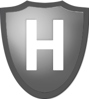
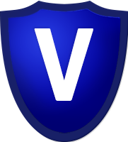
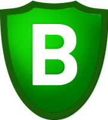

# Badges

## What are badges for?

Badges are a tool mostly for FCs to quickly see what the fleet composition looks like and to check a pilots fitting meets requirements. To join Elite fleets you must have the Elite badge on TS and on the waitlist. Specialist badges are not required for any pilot but are there if you wish to upgrade further.

### Elite Badge

Requirements to get elite badge are:
Elite fitting or better WITH implants 1-10 and all skills to elite or better for the applicable ship. (See your skills page)

### Elite Gold Badge

Requirements to get elite gold badge are:
Elite badge pre-requisites plus all skills to elite gold for the applicable ship. (See your skills page)

### Bastion Specialist

Requirements to get bastion specialist badge are:
Elite badge pre-requisites for a Bastion-capable ship plus abyssal damage modules with a minimum of 29% DPS Bonus, Marauders skill to 5, and abyssal plate with minimum 6k raw armor HP bonus.

### Web Specialist

Requirements to get web specialist badge are:
Elite badge pre-requisites for a Vindicator plus abyssal webifiers with minimum of 16km base range & 62% base strength bonus plus Gallente BS skill to 5.

### Logistics Specialist

Permitted to fly Nestor Logistics. Requires all Nestor skills to elite plus "training" for the use of Nestor, of which 3 Full HQ FC sign offs are required.

### Starter Pilot

Pilot is new to TDF & Incursions and/or has starter skills.

### Council Member

Member of the TDF council, which makes decisions that impact the community.

### Fleet Commander Trainer

Permitted to use TDF comms to run fleets and to take a fleet into Headquarters, Assault and Vanguard sites with SRP cover.
Can promote Trainee FC's to full HQ/AS/VG tags and conduct van/bus fleets for trainee FC's.

### Headquarters, Assault & Vanguard Fleet Commander

Permitted to use TDF comms to run fleets and to take a fleet into Headquarters, Assault and Vanguard sites with SRP cover.

### Probationary Headquarters, Assault & Vanguard Fleet Commander

Permitted to use TDF comms to run fleets and to take a fleet into Headquarters, Assault and Vanguard sites with SRP cover. Cannot take training nestors or do backseats for Trainee FC's.

### Assault & Vanguard Fleet Commander

Permitted to use TDF comms to run fleets and to take a fleet into Assault and Vanguard sites with SRP cover.

### Vanguard Fleet Commander

Permitted to use TDF comms to run fleets and to take a fleet into Vanguard sites with SRP cover.

### Trainee Fleet Commander

Permitted to use TDF comms to run fleets and to take a fleet into sites with SRP cover provided an FC with the badge relevant to the site is in the fleet.

### Back-Channel

Pilot has access to the back comms channel on TeamSpeak.

### Hybrid Implant Set

Pilot has Hybrid implant set (Amulet 1-5 Hardwires 6-10), only visible on X-UP page.

### Amulet Implant Set

Pilot has Amulet implant set including relevant hardwires, only visible on X-UP page.

### Warpspeed Implant Set

Pilot has Ascendancy implant set including relevant hardwires, only visible on X-UP page.

