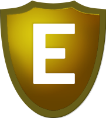

# Badges

## Uses

Badges are a tool mostly for FCs to quickly see what the fleet composition looks like and to check a pilots fitting meets requirements. Used to quickly verify information about a pilot without the need for every FC to know exactly what every pilot has on every toon they have in the whole game.

And some people like them.

To attain an implant badge, mail any FC with a screenshot of the set. For others, mail an FC and they will start the process of you getting it.

## Implants

### Amulet Set

    Slot 1: High-grade Amulet Alpha
    Slot 2: High-grade Amulet Beta
    Slot 3: High-grade Amulet Gamma
    Slot 4: High-grade Amulet Delta
    Slot 5: High-grade Amulet Epsilon
    Slot 6: High-grade Amulet Omega
    Slot 7: Ogdin's Eye Coordination Enhancer or better
    Slot 8: EM-806 or MR-807
    Slot 9: RF-906 or better
    Slot 10: LH-1006 or LE-1006 or better

### Ascendency Set

    Slot 1: High-grade Ascendency Alpha
    Slot 2: High-grade Ascendency Beta
    Slot 3: High-grade Ascendency Gamma
    Slot 4: High-grade Ascendency Delta
    Slot 5: High-grade Ascendency Epsilon
    Slot 6: High-grade Ascendency Omega or WS-618
    Slot 7: Ogdin's Eye Coordination Enhancer or better
    Slot 8: EM-806 or MR-807
    Slot 9: RF-906 or better
    Slot 10: LH-1006 or LE-1006 or better

### Hybrid Set

    Slot 1: High-grade Amulet Alpha
    Slot 2: High-grade Amulet Beta
    Slot 3: High-grade Amulet Gamma
    Slot 4: High-grade Amulet Delta
    Slot 5: High-grade Amulet Epsilon
    Slot 6: WS-618
    Slot 7: Ogdin's Eye Coordination Enhancer or better
    Slot 8: EM-806 or MR-807
    Slot 9: RF-906 or better
    Slot 10: LH-1006 or LE-1006 or better

## Utility

### Back-Channel

Pilot has access to the back comms channel on TeamSpeak.

### Elite Badge

Elite fitting or better  
AND  
Skills listed in the Elite Skills tab of the Skills page

### Shame Badge

There can be no greater heresy.

The council have decided to have you hung by your entrails and your corpse paraded through the city.

### Elite Gold Badge

Elite Badge  
AND  
Skills listed in the Eite Gold tab of the Skills page

## Roles

### Logistics Specialist

Permitted to fly Nestor Logistics.

### Missing minimum skills

The player is missing some important skills.

## Fleet Commanders

### Vanguard Fleet Commander

Permitted to use TDF comms to run fleets and to take a fleet into Vanguard sites with SRP cover.

### Assault & Vanguard Fleet Commander

Permitted to use TDF comms to run fleets and to take a fleet into Assault and Vanguard sites with SRP cover.

### Headquarters, Assault & Vanguard Fleet Commander

Permitted to use TDF comms to run fleets and to take a fleet into Headquarters, Assault and Vanguard sites with SRP cover.

### Trainee Fleet Commander

Permitted to use TDF comms to run fleets and to take a fleet into sites with SRP cover provided an FC with the badge relevant to the site is in the fleet.

### Fleet Commander Trainer

Does this need explaining?

## Council

### Council Member

Voted into council by the other Fleet Commanders of TDF.
