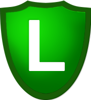
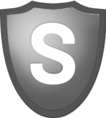
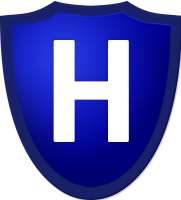
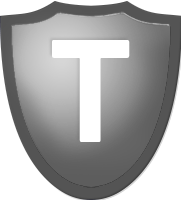

# Badges

## What are badges for?

Badges are a tool mostly for FCs to quickly see what the fleet composition looks like and to check a pilots fitting meets requirements. Used to quickly verify information about a pilot without the need for every FC to know exactly what every pilot has. Plus some people like them. To obtain a badge, ask an FC and they will start the process.

### Elite Badge

Elite fitting or better WITH implants 1-10 and all skills to elite or better for the applicable ship. (See your skills page)

### Elite Gold Badge

Elite badge pre requisites plus all skills to elite gold for the applicable ship. (See your skills page)

### Bastion

Elite badge pre requisites for a Bastion-capable ship plus abyssal damage modules (better than faction).

### Logistics Specialist

Permitted to fly Nestor Logistics.

### Starter Pilot

Pilot is new to TDF & Incursions and/or has starter skills.

### Council Member

Member of the TDF council, which makes decisions that impact the community.

### Fleet Commander Trainer

Permitted to use TDF comms to run fleets and to take a fleet into Headquarters, Assault and Vanguard sites with SRP cover.
Can promote Trainee FC's to full HQ/AS/VG tags and conduct bus fleets for trainee FC's.

### Headquarters, Assault & Vanguard Fleet Commander

Permitted to use TDF comms to run fleets and to take a fleet into Headquarters, Assault and Vanguard sites with SRP cover.

### Assault & Vanguard Fleet Commander

Permitted to use TDF comms to run fleets and to take a fleet into Assault and Vanguard sites with SRP cover.

### Vanguard Fleet Commander

Permitted to use TDF comms to run fleets and to take a fleet into Vanguard sites with SRP cover.

### Trainee Fleet Commander

Permitted to use TDF comms to run fleets and to take a fleet into sites with SRP cover provided an FC with the badge relevant to the site is in the fleet.

### Back-Channel

Pilot has access to the back comms channel on TeamSpeak.

### Hybrid Implant Set

Pilot has Hybrid implant set (Amulet 1-5 Hardwires 6-10), only visible on X-UP page.

### Amulet Implant Set

Pilot has Amulet implant set including relevant hardwires, only visible on X-UP page.

### Warpspeed Implant Set

Pilot has Ascendancy implant set including relevant hardwires, only visible on X-UP page.

