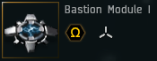
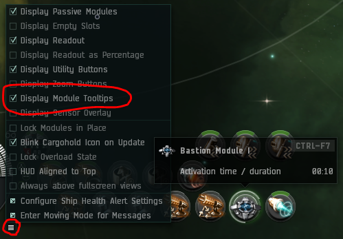
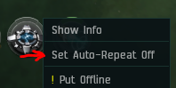

# Bastion guide

With the Bastions of War changes, marauders now do double damage while in Bastion. This is obviously huge but comes at the downside of being unable to receive reps from logi. This guide should cover most things you need to know to run Bastion whilst receiving SRP. The bastion badge, which requires full elite + abyssal damage mods is not required to use bastion, but it is encouraged to obtain it.

Pilot error is NOT COVERED under SRP. If you Bastion by mistake at the wrong time, no SRP. If you jump out of rep range, no SRP.

## To use bastion we recommend pilots to learn the following:

-  Know how aggro switches work in incursions. (Switches occur every minute after the intial wave spawn)
-  Know all the incursion site anchoring positions. Use the [Anchoring Guide](/guide/anchoring) for specifics.
-  Know how logistics work. (Nestors have limited rep ranges, and armor reps apply at the end of their cycle unlike shield reps)
-  Know the different Sansha rats. [Sansha NPCs](https://eve-incursions.de/rats) is a great resource. 
-  Be able to communicate with the FC.

## General rules/requirements if you want SRP

1.  **Auto repeat is off at all times.** (You are actively encouraged to use "CTRL+Left click" during TPPH & NRF)
2.  **Bastion in lowest module row, NO SHORTCUT!**
3.  All tank skills must be at basic level for your chosen ship or higher (check [skills page](/skills))
4.  When using the micro jump drive if you jump in a bad direction, this is classed as pilot error and WILL NOT be covered under SRP. (Being bumped by another fleet member is counted as pilot error and also not covered under SRP).

## Using Bastion

- Enabling Module Tooltips - Enabling module tooltips will make it so you can see your bastion timers, this is important so that you can give logi a countdown to your cycle ending. This gives logi time to decycle ready for you to come out of bastion and apply their reps.

- Temporary auto cycle - During TPPH's and NRF's we now allow pilots to "CTRL+Left click" their Bastion modules to maximise bastion time, this method of bastioning is a temporary auto-cycle and doesnt require the pilot to enable auto-cycle thus keeping your SRP intact. You will stay in bastion until you manually de-cycle, however the next time you click bastion normally it will still automatically de-cycle. Care should still be taken not to Bastion when you are our of position, see the [Anchoring Guide](/guide/anchoring) for specifics on positioning.

- Kronos - As a Kronos pilot we encourage our pilots to bastion as much as possible to maximise their DPS and to help consolidate aggro. During TCRC's and with the new plate meta Kronos have extended tank and should be pressing the bastion button until a switch occurs onto them. You should still take care not to over bastion with aggro, but until you have it we highly encourage pilots to keep pressing it.

- Paladin - As a Paladin pilot bastion is treated with more care due to the Paladins lower tank, your DPS is not on par with Kronos so during TCRC's you should be listening for switches and bastioning between them to ensure you do not over bastion. Switches occur every minute and bastion cycles are 30 seconds, so you can safely get two bastion cycles in between switches. Learning to watch lasers can make this process much easier. Paladins are encouraged to bastion as much as possible during TPPH's and NRF's, but as always make sure you are not out of position when you do!

## Additional tips

- **Late Entry** - If you enter a TCRC late and the aggro switches to you on the beacon you must check to see if your logi are in rep range, if they are not because they already burned to the tower, or they are quickly approaching it then you must jump immediately and make them aware of the situation.

- **Split Aggro Entrance** - If on a normal TCRC entrance you accidentally get aggro instead of the meat shield make sure to check if you have enough capacitor to jump, and if not ask for battle cap. If you have the Outuni aggro you should have already broadcasted for capacitor. Nestors will be burning towards the tower the moment they enter site so do not get left behind.

- **MJD Cancel** - If you MJD and get bumped you can cycle your bastion module on to prevent the jump from happening, but be aware this will leave you in your current spot and in bastion, so stop shooting and do not pull aggro, you will have the full MJD cooldown timer and your bastion cycle time, our recomendation at this point is to burn with microwarpdrive as normal to anchor once your bastion cycle ends.

- **MWD Trick** - You can give yourself an accelerated warp out using your MWD when nearing the end of bastion cycles, once your bastion cycle is at 10 seconds or less cycle your MWD once (make sure to red cycle it!), when your bastion cycle ends initiate warp to next destination and when your MWD cycle ends you will in effect insta warp out.

- **Stuck Bastion** - If your Bastion module gets stuck on, a workaround that has worked (but not in all cases) has been to move the module to a different row on your module interface. To help prevent stuck bastion cycles you should always have your Bastion module set to auto-repeat off, however there can still be occasions where it gets stuck by itself, the most reliable way we know to prevent this is to red cycle your bastion right after activating it, NEVER red cycle when its close to the end of a cycle however as this is more likely to cause the module to get stuck on than if you simply left it to de-cycle by itself.

- **Gate Sliding** - When coming out of warp you will notice your speed bar will change from "warping" to your m/s number, you can use two tricks to keep your momentum and give yourself a speed boost while coming out of warp, you can either spam click in space in the direction you wish to go, or you can spam click the max speed section on your velocity bar. Using Q-Align technique here will not work as you cannot commit a Q-Align command fast enough.
