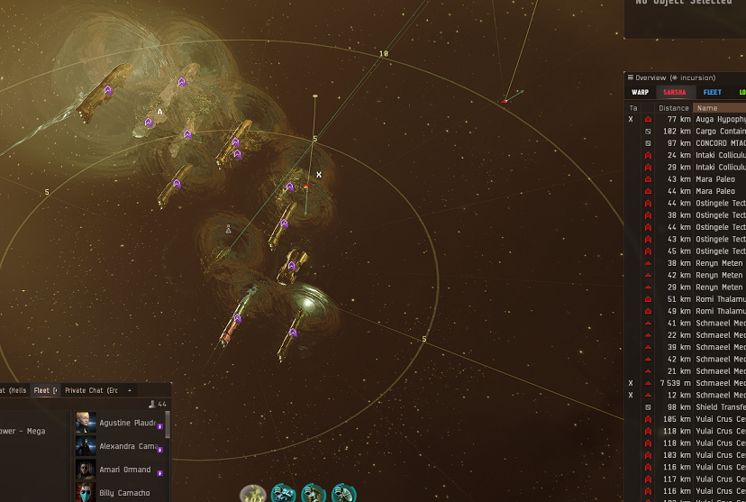

# Bastion guide

With the Bastions of War changes, marauders now do double damage while in Bastion. This is obviously huge, but comes at the downside of being unable to receive reps from logi. This guide should cover most things you need to know to run Bastion whilst receving SRP. The bastion badge, which requires full elite + abyssal damage mods is not required to use bastion, but it is encouraged to obtain it.

Pilot error is NOT COVERED under SRP. If you Bastion by mistake at the wrong time, no SRP. If you jump out of rep range, no SRP.

Bastion is for experienced incursion runners only. This means to use it you MUST:

1.  Know how aggro works in incursions.
2.  Know all the incursion sites
3.  Know how logistics work (especially armor reps).
4.  Know the different Sansha rats.
5.  Be able to communicate with the FC.

## General rules/requirements if you want SRP

1.  **Auto repeat is off at all times.**
2.  **Bastion in lowest module row, NO SHORTCUT!**
3.  You do not Bastion until aggro is established on one target at the start of a wave/site.
4.  If someone dies on-grid you are to turn Bastion off for the rest of the site.
5.  Full Hybrid or Amulet pod is required for SRP.
6.  Basic tank skills.
7.  Be aware when using the micro jump drive of your direction, and of bumps. If you jump poorly and die due to being out of logi range, this is pilot error and WILL NOT be covered under SRP. (Being bumped by another fleet member is also not covered under SRP). If you're not confident, DO NOT USE IT.

## TPPH

Paladin: First two rooms, If CONFIDENT WITH MJD, burn AWAY from the gate for 2 microwarpdrive cycles, activate Bastion for 1 cycle, then turn around and jump to the gate. Otherwise, just burn to gate normally.

Kronos: First two rooms, burn with microwarpdrive towards the gate after at max speed turn off micro and turn bastion on for 1 cycle to slide.

Third room (both): Bastion 1 cycle, then jump towards the left-upper side of the tower. Burn 1 microwarpdrive cycle back towards spawn. Paladins want to end up ABOVE the 2nd/3rd wave spawns.

## NRF

Paladin: Bastion 1 cycle on the beacon, then angle up about 20 degrees and jump. (You want to try and put yourself between the sniper spawns for 2nd and 3rd wave). Stay here until last wave, where on the last wave do 1 cycle of Bastion, then jump towards sniper targets.

Kronos: Microwarpdrive to between second and third wave (the furthest small tower). At the end of the 3rd wave burn over to final wave CQC anchor spot.

## TCRC

TCRCs are special, and you're mostly likely to grab aggro due to your high dps. If you get aggro while in Bastion do not panic, broadcast for shield so the logis can lock you, and provide a countdown in fleet chat or voice comms. A second before coming out you will re-broadcast for armor, so logi can start spamming reps. If you fail to do this, you will not get SRP.

1.  After aggro is on the meat shield and the meat shield is stable you are able to do one cycle on the beacon. (I’d recommend putting the meat shield on your watch list because if you need to battlerep him do it! If he dies and you’re in Bastion, you’re most likely the next target and we can’t rep you.)
2.  During the one cycle kill tagged Deltoles/Outunis. After the cycle is done jump to the left of the tower.
3.  WAIT for the aggro swap from the meat shield to whoever but wait for full switch!!! Once this happens you should have enough time for 1 cycle of bastion. If you are quick you CAN get 2 cycles but please get used to 1 cycle before trying 2.
4.  After each FULL switch you can Bastion 1 cycle. DO NOT Bastion when the tower is in hull.

Be very mindfull of your fellow bastion pilots when jumping from the beacon, be aligned correctly right between the tower and the Sansha Starbase Shield Transfer Array (balls) the or there will be bumps !

