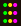
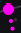
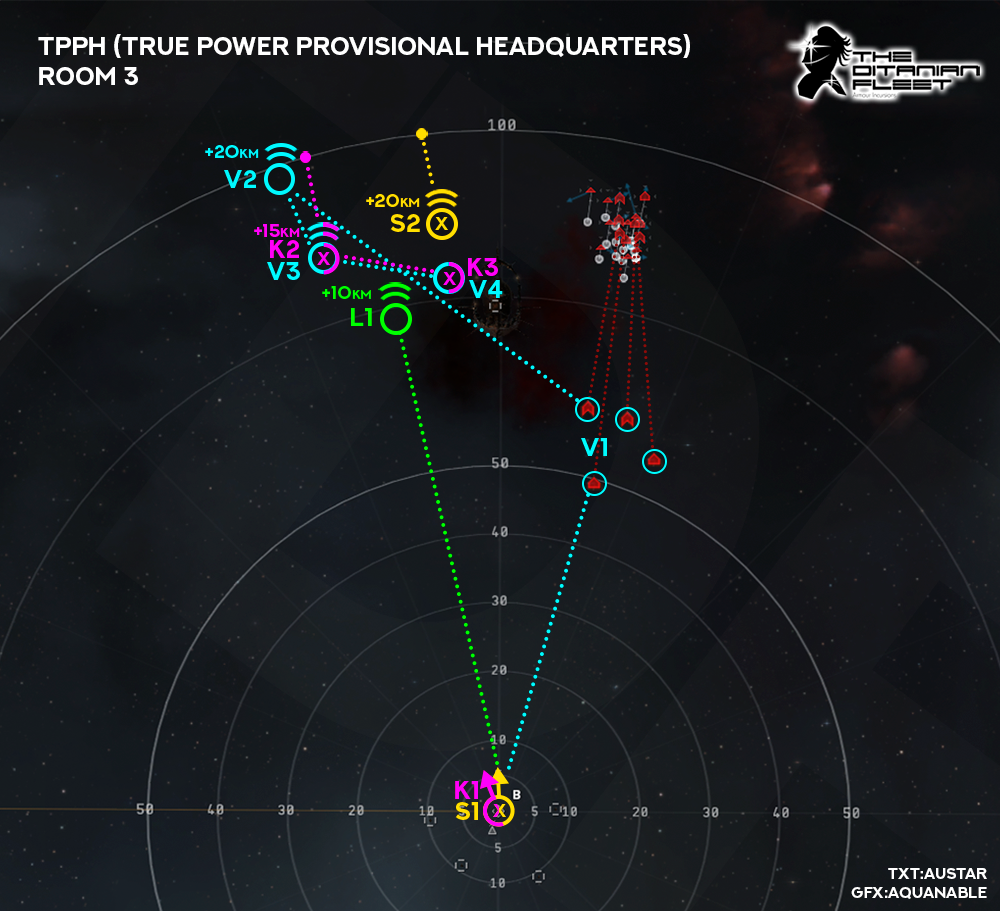

# Anchoring

Below you will find visual and written guidance on anchoring, bastion points and when to Micro Jump Drive. However please remember this is for guidance only, different situations and events can and will change the course of your anchoring, bastion activation and MJD, so it is by no means a "one and only" guide. Hopefully it will serve to help newer pilots to understand where and when to anchor, bastion, & MJD. All guidance is subject to change too so check back as we continue to figure out the best way to keep our ISK/h going up. **Remember, FC instructions overrule any guidance!**

Note: All images are shown as a top-down overview of each room/site with the tactical overlay enabled. Each picture shows the start of 1st wave for each site/room.

## Legend

|         Symbol         |          Meaning           |
| :--------------------: | :------------------------: |
|         |        Anchor point        |
|        |       Bastion point        |
|    |        Flight path         |
|            |       MJD Direction        |
|  |     MJD Landing point      |
|      |     Elevation Distance     |
|         K1/2/3         |       Kronos (pink)        |
|        V1/2/3/4        |     Vindicator (blue)      |
|         S1/2/3         | Paladin/Nightmare (yellow) |
|           L1           |     Logistics (green)      |

## TPPH (True Power Provisional Headquarters)

### Room 1

Bastions:

- Turn left, burn towards outgate (K1 & S1), start with Scorch/Null, bastion as soon as you reach top speed, you should be roughly 1/3 through your burn when you bastion (see x), this lets you drift towards outgate while maintaining bastion. Paladins should use Conflagration during bastion, Null for Kronos (unless all three battleships are within Void range).

Vindicator:

- Pick an Ostingele and burn to within Void range (V1) shooting Null along the way, web separate targets and call your webs, "drive-by" shoot these targets but use common sense, if fleet is slow, stay and shoot it with Void longer. If someone is already going for your target, pick one which does not have a Vindicator friend! Once your target reaches armor burn to outgate (V2).

Nightmare:

- Turn left, burn to outgate (S1), switch to Conflagration where appropriate to apply max DPS.

Logistics:

- Turn left, burn to outgate (L1).

### Room 2

Bastions:

- Start with Scorch/Null, burn towards outgate (K1 & S1), bastion as soon as you reach top speed (see x), drift towards outgate. Paladins switch to Conflagration once Sansha in range, Null for Kronos entire room unless several targets in Void range.

Vindicator:

- Pick a Romi or Ostingele and burn to within Void range (V1) shooting Null along the way, web separate targets and call your webs, "drive-by" shoot these targets, if someone is already going for your target, pick a different one. Once target hits armor, burn to outgate (V2)

Nightmare:

- Burn straight to outgate (S1), switch to Conflagration where appropriate to apply max DPS.

Logistics:

- Burn to outgate (L1).

### Room 3

Bastions:

- Bastion one cycle as soon as you land on beacon (K1 & S1) use Scorch/Null "It's Tama Time!", once bastion cycle ends Q align to the left of tower and up, add roughly 20km for elevation. As Kronos you're aiming to jump right on-top of 2nd wave spawn (see pink MJD landing point), but you are burning 10km back (K2) to be in Void range for both 2nd & 3rd wave. As Paladin you want to MJD roughly 10km from 2nd wave spawn (see yellow MJD landing point) so that you land between the wave and tower, Paladins should also burn back 10km (S2) to be in optimal range with Conflagration of all wave spawns and tower. **Burning back here is VERY important for both bastion ships as it allows you to stay in bastion throughout both waves and be in optimal range of high DPS ammo.** Kronos should burn to the final anchor point (K3) once 3rd wave is nearly finished.

Vindicator:

- Webs are key to fast site times, you should pick a Romi or Ostingele and burn to within Void range (V1) shooting Null along the way, web separate targets and call your webs, "drive-by" shoot these targets, if someone is already going for your target, pick a different one. Anchoring for the next two waves is more important here so do not waste time and keep burning to your next anchor (V2) you need to be in position before the 2nd wave spawns. During 2nd wave spread your webs, call them, and as the wave is dying slowboat to your next anchor point (V3), when the 3rd wave spawns its the same process as the previous wave, spread webs, call them, slowboat anchor to your final point (V4) on the tower.

Nightmare:

- When entering the room sit still, shoot targets as per FC instruction, once bastion cycles end for other pilots you want to MJD roughly 10km from 2nd wave spawn and make sure to add 20km or so elevation (see yellow MJD landing point) so that you land between the wave and tower, Nightmares should also burn back 10km (S2) to be in optimal range with Conflagration of all wave spawns and tower. Your anchors are the same as Paladins just without bastion cycles in them.

Logistics:

- It's important to get away from the beacon quickly here, use the gate sliding technique so you can get to your anchor (L1) asap. With everyone in bastion on the beacon and most of the NPCs out of range, there is low damage from NPCs. However, should a pilot make a mistake and MJD into the aggro you want to be burning into rep range as fast as possible. Make sure to elevate your anchor point so that you are inline with top of tower roughly.

## NRF (Nation Rebirth Facility)

Bastions:

- Paladins one cycle bastion as soon as you land on beacon (S1) once bastion cycle ends jump forward to anchor (S2) align slightly left and add about 15km elevation. You are aiming to land between the 2nd and 3rd wave spawns for Conflagration optimal range. Continue to bastion through 2nd and 3rd wave spawns shooting Conflagration, once 3rd wave is nearly dead align to next anchor (S3) and add roughly another 15km elevation to align _(this is a good time to bring in drones!)_. Once final wave spawns jump to anchor (S3), bastion until 4th wave is nearly dead and make sure to use Conflagration, try to be out of bastion before the site finishes to ensure quick exit.
- Kronos should burn toward first anchor (K1) once at max speed bastion one cycle (see x enroute to K1) once bastion ends continue toward (K1) to anchor for 2nd and 3rd wave, bastion through 2nd wave and aim to finish your bastion cycle midway or earlier through 3rd wave, allowing you time to burn to (K2) anchor for 4th wave. Being in position in 4th wave is more important than being in bastion during 3rd wave as Kronos will apply more damage in 4th wave than any other!

Vindicator:

- Pick a Romi, Ostingele or Deltole and burn to within Void range (V1) shooting Null along the way, web separate targets and call your webs, "drive-by" shoot these targets, if someone is already going for your target, pick a different one. Anchoring for the next three waves is important here so do not be late, burn to your next anchor (V2) once your target hits armor, you need to be in position before the 2nd wave spawns. During 2nd wave spread your webs, call them, if your target dies move your web to another NPC, once there are only three Ostingele or Romi left (of any configuration) burn to (V3) anchor so you're in position to web 3rd wave. During 3rd wave web the Romis, call your webs, make sure you spread them to different targets and if you see one getting away move a web or call it out so another Vindicator can catch it. When there are four Romis left in the wave burn to the final anchor (V4). Webbing in 4th wave is again important, spread webs between Outunis, Deltoles, Ostingeles, Romi _(HHHs are primarily responsible for Romi webs but not solely)_, do not bother wasting webs on Intakis or Vylade, they do not need it. Call your webs and move them as necessary.

Nightmare:

- On entry to site sit still on beacon (S1), once mara is dead/bastion ends you can jump forward toward anchor point (S2), align slightly left and add about 15km elevation. You are aiming to land between the 2nd and 3rd wave spawns for Conflagration optimal range. Due to the long cooldown time of MJD for nightmares we recommend Nightmares to stay on the (S2) anchor to shoot CQC targets (the number tags) and not follow Paladins to the final (S3) anchor, should the next site be a TCRC or contest it is much more valuable to have your MJD off cooldown so you can make a jump if necessary.

Logistics:

- Burn forward roughly 65km (L1) so that you are inline with the tower and the smaller structure at (K1) anchor. You want to be about 15km from the structure at (K1), be aware that bastions on the beacon (if they have aggro) will be jumping ahead of you so you need to be in position quickly to apply reps when they land.

## TCRC (True Creations Research Center)

Due to the danger posed by this site, TCRC entrances and exits will be staged, **FOLLOW FC COMMANDS!**

Bastions:

- Once fleet enters site wait for the meatshield to confirm they have established full aggro, once confirmed bastion for one cycle only on the beacon (S1 & K1), shoot Deltoles in order then Outunis and align toward anchor point (S2 & K2). Once bastion cycle ends check you are correctly aligned toward the next anchor and are not likely to bump anyone, MJD to (S2 & K2) to land between the "bubbles" and the tower _"Remember Paladins must finish off Outuni before shooting tower"_. Once in position at (S2 & K2) bastion for one cycle and wait for the aggro to switch to a new target, once this happens you can freely bastion for two cycles until the next aggro switch "note however you cannot delay on cycles, so if unsure then only go for one cycle". Repeat the bastion process until tower pops. However, if the tower is half hull or less do not do anymore bastion cycles.

Vindicator:

- Once fleet enters site you should be sitting still and shooting Deltole and Outuni in order, once the Deltoles are dead you can start your align to the anchor (V2) ensuring that you wont bump anyone, once you confirm you're clear activate MJD to jump to the anchor. When you land press to Ctrl+Space to stop your ship then shoot the tower till it dies, web Schmaeels when they get in range.

Nightmare:

- Once fleet enters site you should be sitting still and shooting Deltole and Outuni in order, once the Deltoles are dead you can start your align to the anchor (V2) ensuring that you wont bump anyone, once you confirm you're clear activate MJD to jump to the anchor. When you land press Ctrl+Space to stop your ship then shoot the tower till it dies _"Remember Nightmares must finish off Outuni before shooting tower"_.

Logistics:

- Immediately burn to your anchor (L1) whilst also providing reps to the meatshield at the start of the site, Nestors have right of way but if avoidable should not bump DPS.
