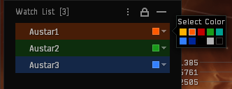
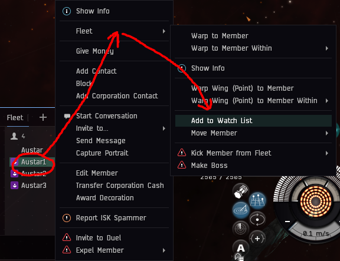
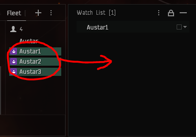
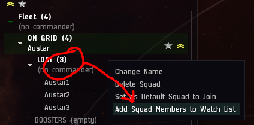
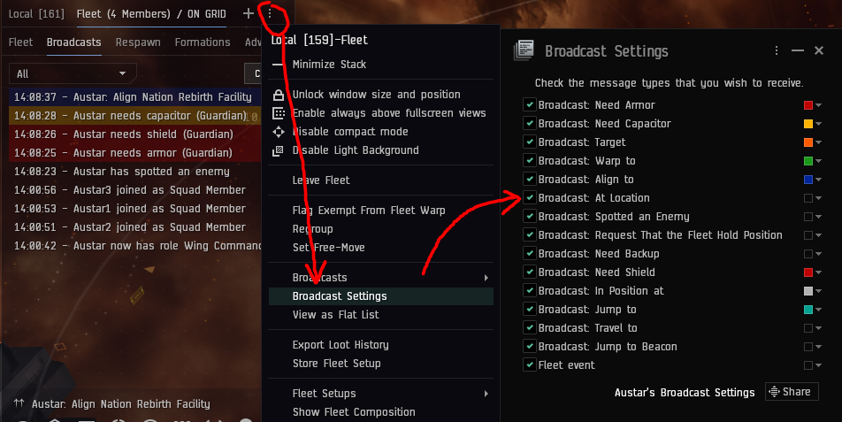
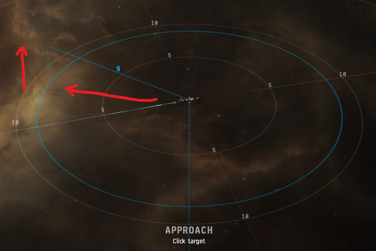
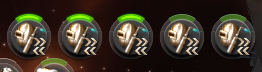

# TDF Logistics Guide

---

Logi is what keeps our fleet alive. We depend on our logi to stay alive and so its important to understand this responsibility before setting out as a logi pilot.

_If logi fails, the fleet dies._

We use three logistics ships. Oneiros, Guardian and Nestor. These ships all have a special role to play in the fleet as well as logistics.

  

- Oneiros - Provides remote tracking links to DDD/HHH
- Guardian - Provides capacitor to ships who need it.
- Nestor - Refitting services and the main reps of the fleet.

Starter Logi pilots should bring either a Guardian or Oneiros to fleet. Nestors are reserved for trusted logi pilots who hold a [Logi Specialist](/badges) badge on the website & teamspeak.

Any cruiser pilot can train to become a trusted Logi pilot, see requirements section below.

### Terminology

- Reps - These are the remote repair modules for sending repairs to other ships.
- Links - Remote Tracking Computers or Remote Sensor Boosters provided by logi pilots to increase optimal ranges & tracking/locking speeds of targeted DPS pilots.
- Cap - Remote Capacitor Transmitter used to give capacitor to pilots who need it.

## Upgrade Policy

Upgrading for logi is expected much the same as DPS.

**You must reach the tier by the time limit set out in the table below:**

|      Tier      | Time Limit |
| :------------: | :--------: |
|    Advanced    |    100h    |
| Elite(Cruiser) |    150h    |
| Elite(Nestor)  |    200h    |

Logistics Specialist badge is the elite badge equivalent for logi. Pilots wishing to only fly cruiser are not expected to get a Nestor and L badge. You can stay in a cruiser if you wish to, but be aware DPS will be prioritised over you if the logi numbers are fulfilled. Should we have a surplus of cruisers in fleet it will be last in first out in favor of DPS ships as well.

## Requirements

- The EM-806 Implant is required for all Nestors & Guardians.

- **Basic skills are a minimum** You can not have any starter level skills for logi ships. Skill requirements can be found on your [skills page](/skills).

- _Exception: **TDF_ONI_HQ_BASIC** (Logistics Cruiser 4 allowed)_

To obtain the Logi Specialist badge you will need three +1's from different FCs, and a minimum 20 hours in cruiser logi (we recommend 50 depending on pilot skill level). You also must have your skills for Nestor to elite before you can attain L badge. But you are permitted to fly TN (training nestor) while these skills are training.

While flying Training Nestor you will be tested on Logi mechanics, requirements and your ability to see who has aggro via lasers and scram notifications.

To get started simply purchase the Nestor fit, x-up with the fit on waitlist and inform the FC that you are hoping to get a spot in fleet as Training Nestor and they will add you to the list. TN spots are limited to 1 in fleet and are not guaranteed so please be patient.

## Fleet Mechanics

### Watchlist

The watchlist is a useful tool for keeping track of certain members of your fleet. For example, other logi, FC, anchors, boosters, aggro magnets.

Colour coding your watchlist is advised so you can see who is who at a glance. You can also lock targets quickly by ctrl+clicking on them in your watchlist, or see if they are taking damage.

To add a member of the fleet to your watchlist you simply right click their name, click pilot > fleet > add to watchlist.

Once you have a watchlist you can also drag player names into the watchlist box to add them.

You can also add an entire squad to your watchlist by right clicking on the squad commander position in the fleet window > add squad members to watch list.

### Broadcasts

Always have your fleet window open on the ‘broadcast history’ setting. This will allow you to see incoming broadcasts from other fleet members when they are in need of rep/cap etc.

The broadcast buttons we use are:

- Armor: Used when a ship is yellow boxed by all/the majority of the sansha
- Shield: Used when a ship is yellow boxed by frigates or troll in a TCRC
- Capacitor: Used when a ship requires capacitor
- Align/Warp to: Used by the FC to let the fleet know where to align to/warp to next.
- Broadcast target: Used mostly by FC/Logi to signify a pilot needs to be locked up/repped
- Spotted enemy: Used by Logi to let the FC know they are ready for the next site

You should colour code these different broadcasts to make them easier to see. Click the menu on the top left of the fleet window to do this in the broadcast settings menu.

**All armor/shield broadcasts should be locked up!**

As a logi you should always try to follow lasers to see who is currently taking damage in the case of a tired/distracted/new pilot who may not broadcast on time. In these cases you may use the ‘Broadcast target’ feature to broadcast this person for the other logi to lock up.

## Logi Guidance

Upon entering a site, cruiser logi should immediately burn forward in all sites; if you immediately orbit a nestor you will most likely go backwards off the beacon, leaving you behind the rest of the fleet. Once the Nestors are close to their anchors, establish an orbit of **7.5km** on your Nestor of choice. You can do this by holding W and clicking on a Nestor in your watchlist. Make sure you have preset your orbit distance by right clicking on the orbit button on the overview and setting it to a predefined 7.5km. Orbit with your prop mod on always.

Nestors should burn directly to their anchors by using the Q align command in space.

Watch for broadcasts. When a shield/armor broadcast is received you should immediately lock them up and **dump all of your reps onto them** for armor broadcasts, for shield broadcasts usually one rep is enough if needed at all.

Once the target is stable and at full armor, cruiser logi quickly decycle down to 1 rep to leave the rest available for the next broadcast. Nestors will dump 6 reps and decycle to 3 as needed but **3 is the MINIMUM for Nestors** on the pilot with main aggro. **Remember armor reps land at the end of the rep cycle**.

Once the aggro has been established and your target is stable you can continue on to do other tasks such as: dropping & assigning your drones, checking your orbit, locking up DDD/HHH for remote tracking links or giving cap to newbros etc.

You will need to learn to manage your locked targets as you learn the logi role. Having your other logi pre-locked is always a good idea, but you dont want to lock too many people or you will run out of locks.

- You can heat your reps by simply holding left shift on your keyboard and clicking on the module, we actively encourage logi to do this regularly as the repair cost for remote reps is 1 paste and should be something you do liberally.

In an emergency, such as a late broadcast, you might find that as you lock the target they are already below 50% armor, in this situation cancel ALL running reps and apply them to the target. Overheat your reps a few cycles, **DO NOT BURN THEM OUT!** Once the pilot has reached 100% armor you may return to repping other targets. Always be ready to speak up on teamspeak in such situations and never be afraid to call for battlereps or more reps if needed. You could be what saves that persons ship!

## Ships

### Nestor

On your watchlist it is important to have **all other Logi pilots**, the boosters, the FC, as well as any known aggro magnets. It is recommended to always keep your other Nestor pilots locked up as well as pre-locking any aggro magnets if needed.

Nestors bring both DPS and Logi drones and it is important to learn when to use what drones. E.g. in a contest you will always drop your DPS drones, but in other sites like a TCRC, you may want to launch Armor bots to handle troll aggro. As always listen to the FC and do as they instruct.

Hull/Shield bots are kept for mostly emergency situations.

**Key Knowledge to remember:**

- Optimal rep range of 29km
- Falloff rep range of 37km
- Maximum rep range of 54km
- Dump 6, decycle to 3 reps
- Split aggro 3 and 3 decycle to 2 reps

### Guardian

When flying a guardian, one of the most important things to remember is that your speed is your tank! Always orbit a Nestor with your afterburner on.

In both AS and HQ sites the method of reps and cap is the same.

Nestors are the highest priority for cap, with boosters/cruiser logi being next. If any of these broadcasts for cap, immediately cancel any current rep/cap cycle and put cap/rep on the broadcast. Cap the person until cap is no longer needed.

When in fleet, you’ll find some pilots will require cap more often than others. You should add these to your watchlist to keep them topped up in times of calm. If there are no cap broadcasts, give cap to Starter squad pilots, but mainly megathrons.

For cap broadcasts run continuously while an Outuni is on grid, switching your cap transfer if the outuni switches target. For all other broadcasts, give 3 cycles of cap unless the person states they require more.

**Key Knowledge to remember:**

- Optimal rep range of 58km
- Falloff rep range of 74km
- Maximum rep range of 81km
- Dump 5, decycle to 1 rep
- 3 Cycles of cap unless target has outuni aggro

### Oneiros

When flying a onieros, one of the most important things to remember is that your speed is your tank! Always orbit a Nestor with your afterburner on.

Your special role in the fleet is to provide remote tracking links to the DDD/HHH. If there is more than one oni in fleet, work together with your fellow oni to decide who will link which drone bunny's. The preferred setup when two or more onieros are in fleet is one oni for DDD, and the second oni links each of the three HHH's with one opti link each. Add the DDD/HHHs to your watchlist for faster locking on entering sites.

All links go to DDD in a TCRC.

Generally speaking, most DDD's will want 2 tracking/1 optimal link, while HHH's should get 1 optimal each. However some DDD's may want different links so liase with them to keep them effective. DDD/HHHs will be listed in the fleet MOTD.

**Key Knowledge to remember:**

- Optimal rep range of 58km
- Falloff rep range of 74km
- Maximum rep range of 88km
- Dump 4, decycle to 1 rep
- Links to DDD > HHH

## Sites

### Vanguards (VG)

For all VG sites, lock all fleet members upon entering site, there will be a max of 12 pilots in fleet during VGs. If you do not have enough locks make sure to let the FC know ASAP! Logi cruisers will set up an orbit on the FC to reduce incoming damage. There is no need for Nestors to move in these sites.

### Assualts (AS)

For all AS sites the FC is your anchor, pilots will stay grouped together on the FC but generally you will only be burning 30km or so into the site and sitting on the FC until the site is complete.

### Headquarters (HQ)

Please use the [Anchoring guide](/guide/anchoring) for specifics on positioning but some logi pertinent notes are below.

### True Power Provisional Headquarters (TPPH) & Nation Rebirth Facility (NRF)

Usually there will be Damnation in fleet AKA meatshield which will sit in a pre-determined position to attempt to consolidate aggro on wave spawns, however pilots will often be arriving into the site late and making their way from the beacon. Keep an eye on these pilots and try to do your best to keep them alive, target broadcast as neccessary and if the pilots ship is still dipping ask for more reps. Nestors can burn toward aggro targets to get within their 29km optimal should it be neccessary but no more than one Nestor should ever need to burn back.

The two major dangers to watch for are pilots jumping with aggro at the entry to a room/site, and or jumping from the beacon with aggro on a new wave spawn, often these pilots will be jumping without boosts or out of logi rep ranges. Its important to try your best to save these pilots either by overheating your prop mod, overheating your reps, or calling it out on Teamspeak.

### True Creations Research Center (TCRC)

This site can be particularly dangerous, so as a logi you must pay attention to broadcasts/aggro switches, which occur every minute approximately.

The FC will order the Meatshield (usually a Damnation) to enter the site first and establish the aggro. Depending on how pre-loaded the site is we will take the gate anywhere from 0-30 seconds after the meatshield.

As a cruiser you do not want to take the gate first when FC calls gate status, you have one of the fastest warp speeds. So count to 3 before taking the gate. Nestors should take it immediately on hearing the Gate status.

Upon landing immediately lock the meatshield before doing anything else and dump all reps on them. Then Nestors will burn forward in the direction of the Shield Transfer Array, Cruisers will burn forwards before establishing their orbits.

Aggro shifts quite alot in this site and there are two types of aggro:

Main Aggro (armor broadcast) is when you are red/yellow boxed by the majority of the room and or NPC battleships.

Troll aggro (shield broadcast) is when you are red/yellow boxed by the frigates, or by the Auga/Romi in a TCRC. The aggro can also split between several targets. Lock up all broadcasts!

This site has a live warp-out, which means that once the scrams are cleared, the FC will call for the DPS ships to warp themselves to the next broadcast and the Logi will stay behind and align with prop mods OFF. You should lock up all remaining fleet members on grid, usually the other logi/fc/booster. And the FC will wing warp when it is safe to do so.

Keep an eye out for your align trajectory and if you are likely to bump into one of the remaining structures during your exit let the FC know promptly, they will usually at this point either ask you to warp yourself or take evasive maneuvers. You should never warp yourself out of a TCRC unless specifically told to do so!

### The Kundalini Manifest (MOM)

This is basically a giant TCRC site. And will be run in almost the exact same manner. The only real difference is the appearance of ‘bombers’ called ‘Lirsautton Parachiya’. If you are targeted by these you will be asked to double broadcast for armor. Should you see double armor broadcasts during the MOM site you should immediately lock this person and be prepared to manage the incoming bomber wave.

There can also be ECM bursts from the MOM, when this happens you will need to relock all latest broadcasts and recycle reps/cap.
