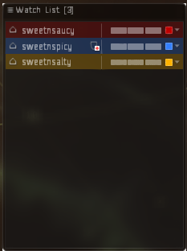
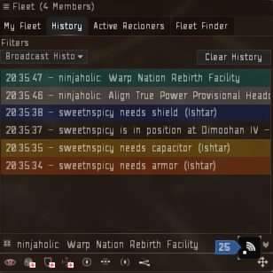

# TDF Logistics Guide

Logi is what keeps our fleet going. We depend on our logi to stay alive and so its important to understand this responsibility before setting out as a logi pilot.

_If logi fails, the fleet dies._

We use three logistics ships. Oneiros, Guardian and Nestor. These ships all have a special role to play in the fleet as well as logistics.

- Oneiros - Provides remote tracking links to DDD/HHH
- Guardian - Provides capacitor to ships who need it.
- Nestor - Refitting services and also the main reps of the fleet. 1 Nestor = 2 cruiser of reps.

Starter Logi pilots should bring either a Guardian or Oneiros to fleet. Nestors are reserved for trusted logi pilots who hold a Logi Specialist badge on teamspeak.

Any cruiser pilot can train to become a trusted Logi pilot, see requirements section below.

## Terminology

- Reps - These are the remote repair modules for sending repairs to other ships.
- Links - Remote Tracking Computers or Remote Sensor Boosters provided by logi pilots to increase tracking/locking speeds of targeting dps pilots.
- Cap - Remote Capacitor Transmitter used to give capacitor to pilots who need it.

## Requirements

The EM-806 Implant is required for all Nestors & Guardians.
**Basic skills are a minimum** You can not have any starter level skills for logi ships. Skill requirements are listed in the in game logi mailing list.

_Exception: TDF_ONI_HQ_STARTER_LOGI4 (Sensor Linking 3, Logistics Cruiser 4 Allowed)_

To obtain Logi Specialist badge you will need 3 signoffs from different FCs, and a minimum 20 hours in cruiser logi (we recommend 50 depending on pilot skill level). You also must have your skills for Nestor to elite before you can attain L badge. But you are permitted to fly TN (training nestor) while these skills are training.

While flying Training Nestor you will be tested on Logi mechanics, requirements and your ability to see who has aggro via lasers and scram notifications.

To get started simply get yourself the Nestor fit, x-up with the fit on waitlist and inform the FC that you are hoping to get a spot in fleet as Training Nestor and they will add you to the list. TN spots are limited to 1 in fleet and are not guaranteed so please be patient.

## Fleet Mechanics

### Watchlist

The watchlist is a useful tool for keeping track of certain members of your fleet. For e.g., other logi, fc, anchors, boosters, aggro magnets.

Colour coding your watchlist is advised so you can see who is who at a glance. You can also lock targets quickly by ctrl+clicking on them in your watchlist, or see if they are taking damage.

To add a member of the fleet to your watchlist you simple right click their name, click pilot > fleet > add to watchlist.

You can also add an entire squad to your watchlist by right clicking on the squad commander position in the fleet window > add squad members to watch list.

### Broadcasts

Always have your fleet window open on the ‘broadcast history’ setting. This will allow you to see incoming broadcasts from other fleet members when they are in need of rep/cap etc.

The broadcast buttons we use are:

- Armor: Used when a ship is red boxed by all/the majority of the sansha
- Shield: Used when a ship is yellow/red boxed by frigates or troll in a TCRC
- Cap: Used when a ship requires capacitor
- Align/Warp to: Used by the FC to let the fleet know where to align to/warp to next.
- Broadcast target: Used mostly by FC/Logi to signify a pilot needs to be locked up/repped
- Spotted enemy: Used by Logi to let the FC know they are ready for the next site

You should colour code these different broadcasts to make them easier to see. Click the menu on the top left of the fleet window to do this in the broadcast settings menu.

All armor/shield broadcasts should be locked up!

As a logi you should always try to follow lasers to see who is currently taking damage in the case of a tired/distracted/new pilot who may not broadcast on time. In these cases you may use the ‘Broadcast target’ feature to broadcast this person for the other logi to lock up.

## Logi Guideance

Upon entering a site, cruiser logi should immediately burn forward in all sites; if you immediately orbit a nestor you will most likely go backwards off the beacon, leaving you behind the rest of the fleet. Once the Nestors are close to their anchors, establish an orbit of 7500m on your Nestor of choice. You can do this by holding W and clicking on a Nestor in your watchlist. Orbit with your prop mod on always.

Nestors should burn directly to their anchors by using the Q align command in space.

Watch for broadcasts. When a shield/armor broadcast is received you should immediately lock them up and **dump all of your reps onto them** (for armor, for shield usually 1 rep is enough if needed at all). Once the target is stable, cruiser logi quickly decycle down to 1 rep to leave the rest available for the next broadcast. Nestors will dump 6 reps and decycle to 3 as needed but 3 is the MINIMUM for Nestors. _Remember armor reps land at the end of the rep cycle_.

Once the aggro has been established and your target is stable you can continue on to do other tasks such as: repping and assigning your drones, checking your orbit etc, lock up DDD/HHH for remote tracking links.

You will need to learn to manage your locked targets as you learn the logi role. Having 1-2 aggro magnets pre-locked is always a good idea, but you dont want to lock too many people or you will eventually run out of locks.

In an emergency, such as a late broadcast, you might find that as you lock the target they are already below 50% armor. Cancel ALL running reps and apply them to the target. You can save anyone else you were repping later. Overheat your reps a few cycles, **DO NOT BURN THEM OUT**! Once the pilot has reached 100% armor you may return to repping other targets. Always be ready to speak up on teamspeak in such situations and never be afraid to call for battlereps or more reps if needed. You could be what saves that persons ship!

## Ships

### Nestor

On your watchlist it is important to have all other Logi pilots, the boosters, the FC, as well as any known aggro magnets. It is recommended to always keep your other Nestor pilots locked up as well as pre-locking any aggro magnets if needed.

Nestors bring both DPS and Logi drones and it is important to learn when to use what drones. E.g. in a contest you will always drop your DPS drones, but in other sites like a TCRC, you may want to launch Armor bots to handle troll aggro. As always listen to the FC and do as they instruct.

Hull/Shield bots are kept for mostly emergency situations.

### Guardian

In both AS and HQ sites the method of reps and cap is the same.

Nestors are the highest priority for cap, with boosters/cruiser logi being next. If any of these broadcasts for cap, immediately cancel any current rep/cap cycle and put cap/rep on the broadcast. Cap the person until cap is no longer needed.

When in fleet, you’ll find some pilots will require cap more often than others; you can add these to your watchlist to keep them topped up in times of calm. If there are no cap broadcasts, give cap to Starter pilots.

For cap broadcasts: Run continuously while an Outuni is on grid, switching your cap transfer if the outuni switches target. For all other broadcasts, give 3 cycles of cap unless the person states they require more.

Dont forget to deploy your drones!

### Oneiros

When flying an Oni, one of the most important things to remember is that your speed is your tank! Always orbit with your afterburner on.

Your special role in the fleet is to provide remote tracking links to the DDD/HHH. If there is more than one Oni in fleet, work together with your fellow oni to decide who will link which drone bunny. Add the DDD/HHHs to your watchlist for faster locking on entering sites.

All links go to DDD in a TCRC.

Generally speaking, most DDD's will want 2 tracking/1 opti link, while HHH's should get 1 opti each. DDD/HHHs will be listed in the fleet MOTD.

## Sites

### Vanguard (VG)

For all VG sites, lock all fleet members upon entering site. If you do not have enough locks make sure to let the FC know ASAP! Logi cruisers will set up an orbit on the FC to reduce incoming damage. There is no need for Nestors to move in these sites.

### Headquarters (HQ)

#### True Power Provisional Headquarters (TPPH)

Upon landing after the first gate, turn left and start burning to the out-gate, Use the Q command to do this. Be sure not to out run the gate! Wait for FC to call ‘Gate Status’.

In the second room you will burn straight ahead to the next out-gate using the same Q command.

Once you land in the third room you will want to immediately burn forward a bit and then establish your obit of 7500km on your chosen Nestor. Nestors will burn directly to their anchor spot which is approx 15km left of the battletower. Deploy your DPS drones.

#### Nation Rebirth Facility (NRF)

After taking the gate Nestors will want to burn approx 75km forward. Staying about 10-15km from the small tower so cruisers can orbit you. Cruisers will want to again burn forward before establishing their orbits on Nestors.

#### True Creations Research Center (TCRC)

This site can be particularly dangerous, so as a logi you must pay attention to broadcasts/aggro switches, which happen every minute approximately.

The FC will order the Meatshield (usually a Damnation) to enter the site first and establish the aggro. Depending on how pre-loaded the site is we will take the gate anywhere from 0-30 seconds after the meatshield.

As a cruiser you do not want to take the gate first when FC calls gate status, you have one of the fastest warp speeds. So count to 3 before taking the gate. Nestors should take it immediately on hearing the Gate status.

Upon landing immediately lock the meatshield before doing anything else and dump all reps on them. Then Nestors will burn forward in the direction of the Shield Transfer Array, Cruisers will burn forwards before establishing their orbits. Once the meatshield is stable cruisers should decycle down to 1 rep, and Nestors down to 3 and be ready to rep the next person.

Aggro shifts quite alot in this site and there are two types of aggro:

Main Aggro (armor broadcast) is when you are red/yellow boxed by the majority of the room.

Troll aggro (shield broadcast) is when you are red/yellow boxed by the frigates, or by the Auga/Romi in a TCRC. The aggro can also split between several targets. Lock up all broadcasts!

This site has a live warp-out, which means that once the scrams are cleared, the FC will call for the DPS ships to warp themselves to the next broadcast and the Logi will stay behind and align with prop mods OFF. You should lock up all remaining fleet members on grid, usually the other logi/fc/booster. And the FC will wing warp when it is safe to do so. You should never warp yourself out of a TCRC unless specifically told to do so!

#### The Kundalini Manifest (MOM)

This is basically a giant TCRC site. And will be run in almost the exact same manner. The only real difference is the appearance of ‘bombers’ called ‘Lirsautton Parachiya’. If you are targeted by these you will be asked to double broadcast for armor. Should you see double armor broadcasts during the MOM site you should immediately lock this person and be prepared to manage the incoming bomber wave.

There can also be ECM bursts from the MOM, when this happens you will need to relock all latest broadcasts and recycle reps/cap.

**DO NOT BUMP MOM!**

And never take the loot unless you are told to do so.
