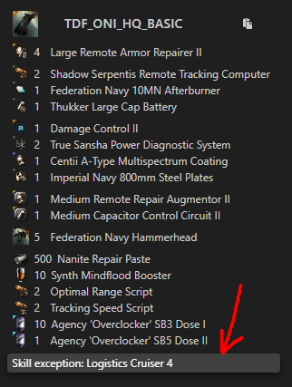

# New-Bro Guide

## Requirements

TDF uses a progress system for pilots, Starter, Basic, Elite & Elite Gold are the different tiers you can achieve on your ship specific skills. You can see your current skill tiers for each ship on the [Skill Page](/skills). The actual level of your skill is displayed on the left, while the next tier level is displayed on the right.

Due to our [upgrade policy](/guide/upgrade), we highly recommend pilots to create an incursion alt when first joining TDF.

### DPS

To get started in TDF all you need is to be able to **online ALL modules on your ship**, and have the **four armor compensation skills at level 2 for starter fits & 4+ for everything else**. The **basic skills** are the skills you should focus on when you start flying. As long as you still have skills at the starter level and are using a starter fit you will be placed in the starter squad, which is limited to 4 - 5 in fleet. Upgrading is highly encouraged.

### LOGI

To fly logi with TDF you will need **basic tier skills as a minimum**, you also need to be able to **fully online all modules on your ship**. Any red skills must be trained before you can fly with the exception of the logi4 onieros fit below:

- Exception: **TDF_ONI_HQ_STARTER_LOGI4** (Sensor Linking 3, Logistics Cruiser 4 Allowed)

Logi spots are limited in fleet to 5 or less usually so we recommend getting a DPS ship alongside your logi ship. More logi specific requirements and guidance can be found in the [Logi guide](/guide/logi).

## Joining TDF's Channel

To find us in-game; join the chat channel **TDF-Official**. You can do this by clicking the little plus button where your chat window is at the top. Then in the channels box type TDF-Official and then click join.

## Reloading MOTD

Message Of The Day (MOTD) is where you will find the most up to date information on all aspects of TDF. If you need to reload the MOTD left click the cog wheel in the top left corner of the chat window then left click "Reload MOTD." Read the MOTD every time you join the channel it will answer most common questions.

## Fittings

To find out our current doctrine please join our fitting mailing lists or use the [Fits Page](/fits). The fittings on the fit page will sometimes have icons on them, these denote exceptions or requirements specific to that fit, you can find the details by clicking the fit and reading the note at the bottom.

To join the mailing lists open up your evemail and then at the bottom left click add mailing list. In the box that opens type the name of the mailing list then click join. The most common sites TDF fly are Headquarters (HQ). Mailing lists are found in **TDF-Official** MOTD.

The mailing lists have a selection of fits which allow for any budget or skill level and they are all covered by the TDF Ship Replacement Program (SRP). All fittings have their minimum skill requirements in the mailing list. **Basic and above require level 4 armor comps while starters only need level 2**.

Pick a fit you would like to fly. If you need help just ask in the TDF-Official channel or in Discord for any advice getting set up.

The general tank requirements when we run sites are as follows

- Vanguards (VG) you need 9850 armor HP + 55% omni resists.  

- Assaults (AS) you need 17k armor HP + 65% omni resists.
 
- **Headquarters (HQ) you need 17k armor HP + 65% omni resists.**

 You still need to fly the correct doctrine fits however. You are allowed to use module variants meta4+ for anything but the following: **Tank modules, this includes rigs**.

## Ship Settings

**Safety Green:** Now you have your fitting you’re nearly there and ready to join fleet. First things first, you need to make sure your safety is set to green. You can see this by undocking your ship. Once in space make sure you have a green button just to the top left of the Main HUD.

**Alarms:** While out in space also make sure your shield/armor/hull alarms are turned on and set to 95%. You do this by clicking on the hamburger menu to the bottom right of your HUD and then click the configure ship health alerts.

**Drones:** Lastly; while in space set your drones to passive and focus fire. You must have drones in your drone bay for the drone window to appear. Click the hamburger menu in the top left of your drone window and select "passive" "focus fire." Passive is a requirement as aggressive drones can cause aggro splits in sites and we dont want that. This gets your expensive drones killed.

## Interface Settings

**Duels/Auto Target Back:** From the escape menu general settings tab set auto decline duel invites and auto targeting to 0 Targets.

**Overview Settings:** Fleet uses tagging to focus fire from all pilots onto a single enemy. Your overview should have at a minimum the tag column enabled. To see the overview window you must be in space. Click the hamburger top left in the overview window and open the overview settings. In the column tab enable the tag column in the overview. The tab presets tab is used to add or remove item groups from showing in your overview.

**Broadcast Settings:** Last thing to do now is setup your broadcasts.

You need to open the fleet window and then click form fleet. Then clicking the chevrons bottom right will pop up the broadcast buttons. Make sure there’s a cross in the bottom right hand corner, which indicates that you broadcast to everyone in fleet.

Next click the hamburger menu and go to broadcast settings. From here choose some colours for your broadcasts so you can easily differentiate them. If you are not logi the most important broadcasts for you to see are "Align To" and "Warp To."

Finally; select the history tab in the fleet window and select "Broadcast History" from the drop down. Any broadcasts to the fleet will appear in this window.

**Loading Presets:** The overview settings and broadcast settings can both be found in the TDF-Official MOTD. If you want to use the TDF recommended ones just find them in the MOTD and click on them to load them.

## Faction Warfare / War Decs / Killrights

Looking at your Character sheet Interactions tab then the Kill rights section, double check you have no kill rights against you. Having a killright available to you is perfectly fine. Then open your corporation window and make sure your corporation is not enrolled in factional warfare or has an active War Dec. If you have any of the above you will be asked to fix them before joining the fleet.

## Keep reading

[First Fleet guide](/guide/xup)
