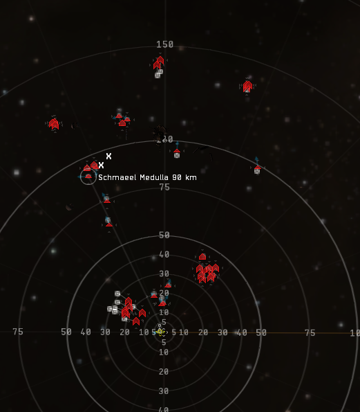

# Scouting guide

An important fleet role is the **Scout**, which an FC can do themselves or delegate. Your job as a scout is to give the FC awareness of the other fleets in system, and to preload the TCRC sites so we can run them faster.

Scouting is done from a second omega account (alt) in a ship that's optimized for (warp) speed. A good and cheap place to start is the Atron Scout at the bottom of this guide. It can be trained in about 15 minutes on a fresh character. A more expensive but even faster option is the Astero. However, please understand that losing scout ships is common, especially early on. Once you have been scouting for a while you will likely discover your own scout ship preference, which could involve interceptors or even a Pacifier.

Scouting is a fairly advanced role that requires multiboxing, so don't try this before you have mastered flying your primary ship.

## Finding sites

First and foremost the job of a scout is to find the fleet a free site before the end of the previous site. You can let the FC know which sites are taken through tags, so the FC can choose a next site. The common tag for "this site is taken" is **X**, though experienced scouts will use all of X/**Y**/**Z** to let the FC know which community is in each site. You can tag a site if you are in a fleet _tagging position_, by right-clicking the beacon, and picking the tag in the tag dropdown, but this is faster if you assign a hotkey (via the settings menu, Shortcuts tab, use the search in the top right).

How you find the sites that are taken can depend on the number of fleets that are running:

- If we are the only fleet in system, there should be no problem finding a free site. Put your scout on the _most favorable site_ to avoid surprises in case another fleet decides it's time to start a fleet.
- If only one other fleet is running you can choose to follow them around, tagging their sites as they take them.
- If two fleets are running you will find that most of the time there is only one clear site. Park your scout on the gate, and when a fleet goes in tag it. Once a new site spawns, warp to it, and repeat.

When the fleet starts a new site the FC will tag the site **A**. Sometimes they forget this, so feel free to tag it yourself, or call them out on their mistake.

Sometimes a fleet will bounce, leaving a tagged site without a fleet in it. It is the scout's job to recognize the situation, and find out which site they bounced from. To tag a site that another fleet bounced from, use **B**, but leave the A tag to differentiate sites that we bounced from ourselves.

Put a J tag on the Kundalini Manifest, so FCs don't accidentally end the focus. The same goes for other anomalies and sites that appear on the overview and aren't related to incursions.

### Most favorable site

The FC will almost always want to go to the most favorable site, which is the site that gives the best ISK per hour. In order of preference this is TCRC, then NRF, then TPPH, and closer always takes preference if there are multiple sites of the same type. If we previously bounced from a site (tagged A), or another fleet did (tagged B), then this may be preferable to a site that's closer.

### D-Scan

The easiest way to find out information about the fleet in a site is the Directional Scanner (D-Scan). If you set it to a distance of 0.1 AU with a range of 360 degrees you will find information about who is in a site in all but the smallest incursion systems. The PVP tab can tell you who is in there, and the Drones tab can tell you whether they are about to leave (scan a few times, if drones disappear then they are about to warp).

The Loot tab will tell you how many wrecks there are in a site. Look for the amount of wrecks but also specific types: a TPPH always spawns exactly 15 rats in the first room and 13 in the second room, with _Arnons_ marking the final wave of the last room. The other sites have variable spawns, but the NRF will only spawn _Outunis_ in the final wave. By looking at these wrecks you can quickly figure out the state of a site without having to be in it.

Periodically uploading the PVP tab of the D-Scan to a site like [dscan.info](https://dscan.info) also creates valuable information for the FC to help with decisions around contesting sites.

## Preloading TCRCs

The TCRC site is special in that it takes about half a minute for all Sansha rats to spawn. If a fleet goes in before everything has spawned then the aggression will be split, making the site less safe and creating more work for the logi.

Loading a TCRC starts the moment a player shows up on the _grid_, which you can do by taking the gate. Once you land in the site, you can choose to either cloak up (if you land within 2000m of the beacon you may need to use the Q align function to move away from the beacon, do not ever use your MWD as it will blow your sig and the frigates will lock you much faster preventing you from cloaking.), or warp away.

If you do cloak, make sure to either warp off before the _meatshield_ goes in, or after the entire fleet has landed and aggro is established on the meatshield. If your timing is wrong, the aggro can go to the scout instead of the meatshield, with potentially deadly results for both your scout and members of the fleet.

The FC will appreciate it if you tag the two _Schmaeels_ close to the MTAC factory (or Romi), and the only _Auga_ that spawns. Those two _Schmaeels_ in particular will respawn, so we do not want to shoot them until the site is done.

Preloading a TCRC is somewhat risky and you may lose your ship if you're not paying attention!



## Finding contests

TDF likes contests, and it's the scout that creates the opportunities. If the _most favorable site_ has a fleet landing on it just before we're about to go there, make sure to let the FC know about it. If at all possible then also tell them which community it is, to make the decision easier.

## Timers

When a site ends, a new one will spawn in roughly 7 minutes and 10 seconds. By setting a timer every time a site goes down you can accurately predict when new sites spawn, and this can help the FC decide whether to wait a few more seconds before starting a site we don't like. A useful website for this is [online-timers.com](https://www.online-timers.com/multiple-timers).

## Thank you

Scouting is a very important fleet role, and you really help the FC a lot by doing it. Site times go down a lot with a good scout. Thank you for being awesome!

## Fits

```
[Atron, Atron Scout]
75mm Gatling Rail I
Small S95a Scoped Remote Shield Booster
Prototype Cloaking Device I
Festival Launcher

PL-0 Scoped Cargo Scanner
Ta3 Compact Ship Scanner
5MN Quad LiF Restrained Microwarpdrive

Type-D Restrained Inertial Stabilizers
Type-D Restrained Inertial Stabilizers
Type-D Restrained Inertial Stabilizers

Small Hyperspatial Velocity Optimizer II
Small Hyperspatial Velocity Optimizer II
Small Hyperspatial Velocity Optimizer II


Iron Charge S x1000
Four Freedoms Firework x100
```

```
[Astero, Astero]
Covert Ops Cloaking Device II

Small Shield Extender II
Small Shield Extender II
Multispectrum Shield Hardener II
5MN Quad LiF Restrained Microwarpdrive

Inertial Stabilizers II
Inertial Stabilizers II
Inertial Stabilizers II
Experimental Hyperspatial Accelerator

Small Hyperspatial Velocity Optimizer II
Small Hyperspatial Velocity Optimizer II
Small Hyperspatial Velocity Optimizer II
```
