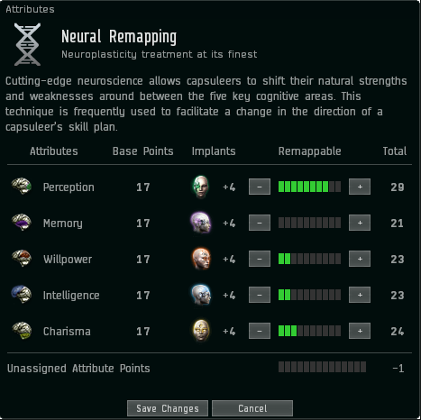
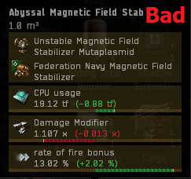

# General Tips

## Item Variants

There are many items in eve that have variants with identical stats but different names. Saved fittings will just save what has been fitted. When looking at saved fittings be sure to check the market for module variants. The module stats are what matters not that the exact same module is used. Very often you can get the same fitting for less money.

This saved Nightmare fitting could be bought for less if I buy the True Sansha Heat Sinks and the Corpum A-Type MEMs. Drag and drop items into the Compare Tool or go to item variations and click compare.

Commonly used items are:

- Damage Control Unit
- Magnetic Field Stabilizer
- Heat Sink
- Multispectrum Energized Membrane
- Tracking Computer
- Sensor Booster
- Stasis Webifier
- Antimatter Ammunition

## Neural Remapping

Each skill has two associated Neural attributes. When training that skill, the more points you have in those two attributes, the faster the skill trains.

TDF do not recommend using Neural Remapping if you have zero bonus neural remaps available. New players get three bonus remaps, these can be used to remap any time; three times. After these three remaps have been used you are committed to an entire year with the attributes you set. Neural remaps are for accelerating a specific training queue or skill plan and they will hurt your training time if you deviate from that queue.

The only way to get a truly optimal remap is to use an optimiser with your characters overall attributes and exact skill queue entered into it. [EveMon](https://github.com/peterhaneve/evemon/releases/) has this function, use at your own risk.

## Cerebral Accelerators

Cerebral accelerators can also be used to increase your attributes, reducing training times even further. Training Biology to level 5 doubles the length of time these (and all other) boosters are active, this includes your drugs contained in your fittings. Accelerators are optional and a much more sensible choice vs injectors when you have 80 Million SP or more. There are several different types of accelerators and the CCP events often drop limited time ones so make good use of them.

 

## Implants

### Attribute Implants

With the Cybernetics 5 Skill you will be capable of using a +5 Learning clone, or better yet an Ascendancy, Amulet or Hybrid clone which have built in attribute bonuses alongside their inherent fleet bonus. +5 Learning implants can be bought from most non concord LP stores for 65 million isk and 65k LP. You can convert your concord LP to faction LP at any of these LP stores. A +4 learning clone is acceptable if you are still in training for cybernetics 5.

See the benefits of a good learning clone below. Implants are plugged in on the left example.

 

### Implant Sets

You will need to purchase implant sets to obtain your Elite badge within TDF, you can save yourself some money by buying your hardwire implants (slots 6, 8, 9, 10) from the CONCORD LP store, you can even use the LP you earn from incursions to do this! Use the [station locator](https://nearest.ouroborus.org/) website to find the nearest concord station to you. It will cost you 250k LP and 250 million isk to purchase the correct hardwires, LP value and market prices vary frequently, so make sure to check the prices of hardwires on the market to see if you are still getting a good deal when using this method. Unfortunately you cannot obtain Amulets/Ascendancy implants from the CONCORD LP store.

- There is also the case of the slot 7 Ogdin's Eye Coordination Enhancer, it has the same tracking bonus as the MR-706 but the Ogdin is much cheaper. Even if you buy the MR-706 with LP the Ogdins is cheaper due to the value of LP.

### Mindlinks

The booster slot 10 mindlinks can also be purchased from LP stores, however it requires two trips to different LP stores. You can purchase the Tech II mindlinks from CONCORD, bear in mind you will need both the Armor & Skirmish, or Armor & Information Tech II variants to convert to one Faction mindlink.

Once you have the Tech II base implants take them to the LP store which sells the type of mindlink implant you wish to obtain and convert them into either the Federation Navy Command Mindlink or the Imperial Navy Command Mindlink. This should cost you alot less than buying the implant directly from market.

## Abyssal Modules

Abyssal modules are great and can give you increased DPS, huge armor bonuses, or even help you go faster, here at TDF we love pilots who invest. But they can be very expensive, here are some tips to help you get the most for your isk.

_"Please note, abyssal modules should **ALWAYS** be better than faction for their intended purpose. Pilots who try to cheat the system and buy poor abyssals will be banned."_

- Damage modules, when purchasing these you should in general care more about the "Damage modifier" vs "ROF", with the implants and Bastion module, your stacking penalties for ROF are high, so in general a module with a higher modifier will give you more DPS. As with all abyssal modules, you should simulate your fit with it to see if it gives you an increase over the previous module you had installed and to check your fitting is ok.

 

- Plates, in general with plates there is only two stats you really need to care about, the HP increase, and the CPU, powergrid is unlikely to cause you issues on most battleships, and the mass addition is usually so minimal it doesnt even add a tick on to your align time. Additional mass can however make it take longer to warp when your MWD is on and you are "drifting" so use your judgement and wallet to decide what is most important to you.

- Microwarpdrives, when it comes to your MWD, speed is key, we all want to go faster, but it shouldnt come at the cost of fitting or capacitor use either. A good increase in speed can be the difference in those contests where we are on the limit, so try to upgrade your MWD last and find one that fits in with your other abyssal modules in regards to fitting, if you have plenty of fitting left you can afford to let the CPU drop. But your priority should be: Speed > CPU > Activation cost > Sig radius.

## Usefull Links

- [Best place to buy abyssals!](https://mutaplasmid.space/appraisal/)
- [Gank intel](https://eve-gatecheck.space/eve/)
- [Tool for people who sell their LP themselves](https://www.fuzzwork.co.uk/lpstore/)
- [Fit tool](https://github.com/pyfa-org/Pyfa/releases/)
- [Skill plan tool](https://github.com/peterhaneve/evemon/releases/)
- [Online market tool 1](https://evemarketer.com/)
- [Online market tool 2](https://market.fuzzwork.co.uk/type/)
- [Incursion rats](https://eve-incursions.de/rats)
- [Live DPS tracker](https://github.com/ArtificialQualia/PyEveLiveDPS)
- [Concord station locator](https://nearest.ouroborus.org/})
