# General Tips

## Item Variants

There are many items in eve that have variants with identical stats but different names. Saved fittings will just save what has been fitted. When looking at saved fittings be sure to check the market for module variants. The module stats are what matters not that the exact same module is used. Very often you can get the same fitting for less isk.

This saved Nightmare fitting could be bought for less if I buy the True Sansha Heat Sinks and the Corpum A-Type MEMs. Drag and drop items into the Compare Tool or go to item variations and click compare.

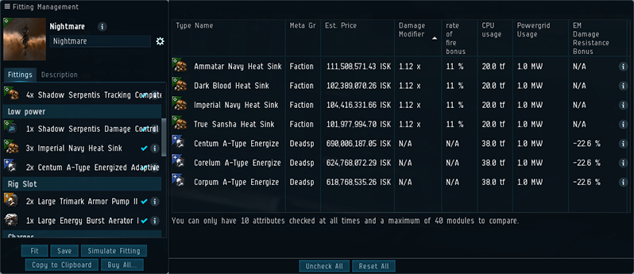

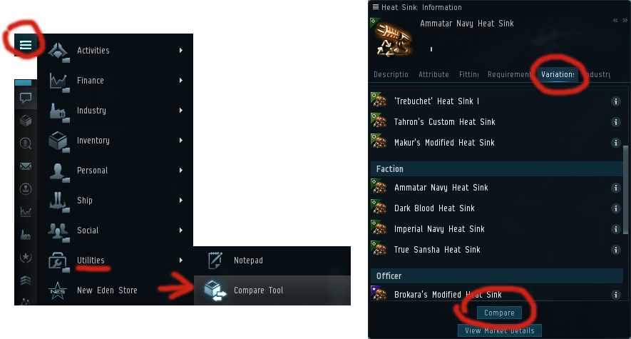

Commonly used item variations are:

- Damage Control Unit
- Magnetic Field Stabilizer
- Heat Sink
- Multispectrum Energized Membrane
- Multispectrum Coatings
- Tracking Computer
- Sensor Booster
- Stasis Webifier
- Microwarpdrive
- All ammo types

## Neural Remapping

Remapping can be beneficial for your slow training at any point in the game. It can shave serveral days off your training, but the downside is it locks you into certain training queues. Each skill has two associated neural attributes. When training that skill the more points you have in those two attributes the faster the skill trains.

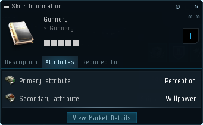

TDF do not recommend using neural Remapping if you have zero bonus neural remaps available. New players get three bonus remaps, these can be used to remap any time. After these three remaps have been used you are committed to an entire year with the attributes you set. Neural remaps are for accelerating a specific training queue or skill plan and they will hurt your training time if you deviate from that plan.

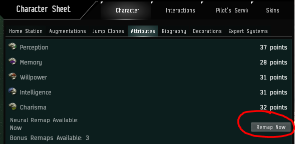

The only way to get a truly optimal remap is to use an optimiser with your characters overall attributes and exact skill queue entered into it. [EveMon](https://github.com/peterhaneve/evemon/releases/) has this function, use at your own risk.

## Cerebral Accelerators

Cerebral accelerators can also be used to increase your attributes, reducing training times even further. Training biology to level 5 doubles the length of time boosters are active, this includes drugs contained in your fittings. Accelerators are optional and a much more sensible choice vs injectors when you have 80 Million SP or more. There are several different types of accelerators and the CCP events often drop limited time ones so make good use of them.

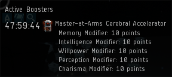 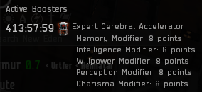

## Implants

### Attribute Implants

With the cybernetics skill at level 5 you will be capable of using a +5 learning clone. +5 learning implants can be bought from most non concord LP stores for 65 million isk and 65k LP. You can convert your concord LP to faction LP at any of these LP stores. A +4 learning clone is acceptable if you are still in training for cybernetics 5. We recommend pilots to move to Ascendancy, Amulet or Hybrid implants when reaching advanced fits. The implant sets have built in attribute bonuses alongside their inherent fleet bonus.

See the benefits of a good learning clone below. Implants are plugged in on the left most example.

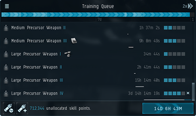 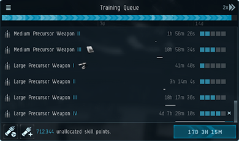

### Implant Sets

You will need to purchase implant sets to obtain your Elite badge within TDF. You can save yourself some isk by buying your hardwire implants (slots 6, 8, 9, 10) from the CONCORD LP store, you can even use the LP you earn from incursions to do this! Use the [station locator](https://nearest.ouroborus.org/) website to find the nearest high security concord station to you. It will cost you 250k LP and 250 million isk to purchase the correct hardwires. LP value and market prices vary frequently, so make sure to check the prices of hardwires on the market to see if you are still getting a good deal when using this method. Unfortunately you cannot obtain Amulets/Ascendancy implants from the CONCORD LP store.

- There is also the case of the slot 7 Ogdin's Eye Coordination Enhancer, it has the same tracking bonus as the MR-706 but the Ogdin is much cheaper. Even if you buy the MR-706 with LP the Ogdins is cheaper due to the value of LP.

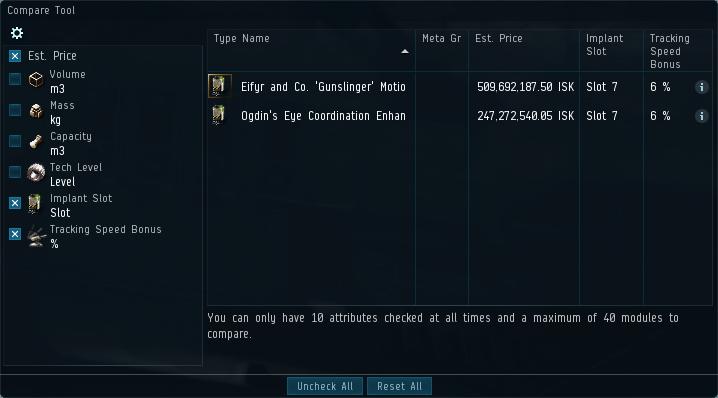

### Mindlinks

The booster slot 10 mindlinks can also be purchased from LP stores. However, it requires trips to two different LP stores. You can purchase the tech II mindlinks from the CONCORD LP store, bear in mind you will need both the armor & skirmish mind links for the primary booster, or armor & information mindlinks for the secondary booster. You will need both of the tech II variants to convert to one faction mindlink.

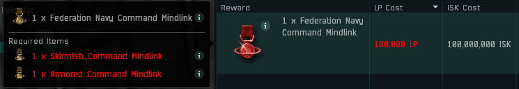

The tech II base implants can be converted into Federation Navy Command Mindlink for the primary booster, or the Imperial Navy Command Mindlink for the secondary booster. You can use [Fuzzworks LP](https://www.fuzzwork.co.uk/lpstore/) to search for the mindlink you want & choose a faction that has it for sale. The [station locator](https://nearest.ouroborus.org/) can help you to find the nearest station homing the factions you require. This should save you isk vs buying the implant directly from the market.

## Abyssal Modules

Abyssal modules are great and can give you increased DPS, huge armor bonuses, or even help you go faster. Here at TDF we love pilots who invest, but they can be very expensive. Here are some tips to help you get the most for your isk.

_"Please note, each abyssal module must be a **FACTION ROLE AND HAVE BETTER THAN BASE STATS** for their intended purpose. Pilots who try to cheat the system and buy tech II or meta abyssals will be banned. Abyssal Damage Control Units are also banned."_

Abyssal modules are created using different tiers of mutaplasmid; decayed, gravid and unstable. Each tier will have increased statistic ranges you can roll for each module and increase with cost based on this. The picture below shows each tier going from lowest to highest.

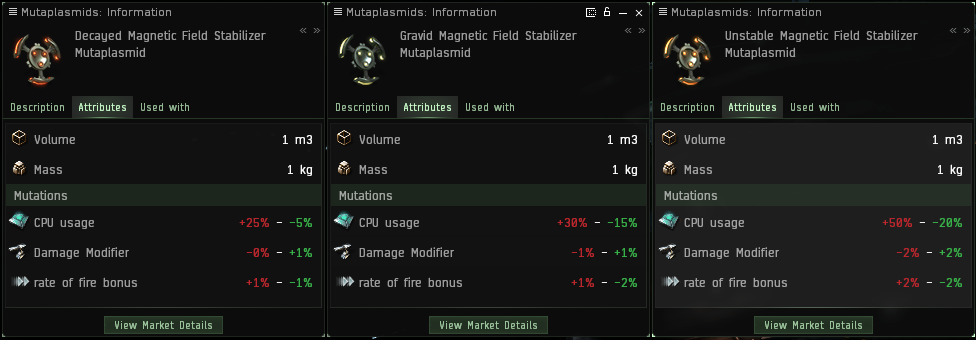

- Damage modules, when purchasing these you should prioritise the "damage modifier" vs "rate of fire". Due to the implants and bastion module your stacking penalties for rate of fire are high, so a module with a higher damage modifier compared to rate of fire will give you more DPS. However you should not ignore rate of fire as any increase in overall DPS will be an improvement. As with all abyssal modules, you should simulate your fit with any potential abyssals to see if you gain an increase over the previous module, and to check your fitting is ok. Base faction modules give 25.8% DPS, so make sure your abyssal is higher than this or it will be rejected. You can use the [abyssal apraisals](https://mutaplasmid.space/appraisal/) to check your modules DPS%.

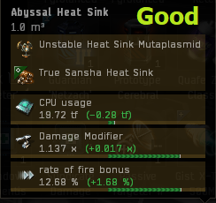 

- Plates, with plates there is only two stats you should prioritise; the hitpoint bonus and the CPU usage. Powergrid is unlikely to cause you issues on most battleships and the mass addition is minimal, so while it increases align time its effects are insignificant (see the examples). Additional mass however increases time to warp when your microwarpdrive is on and you are "drifting". So use your judgement and wallet to decide what is most important to you. We recommend 6k+ hitpoint plates for Paladins, and two plates totalling 12k+ hitpoints combined for Kronos. These plates will make you eligible for bastion badge.

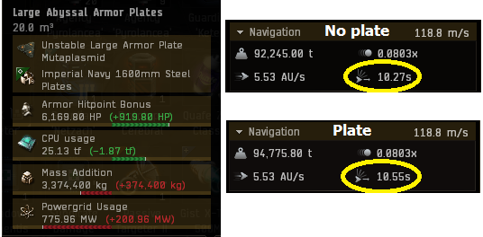

- Stasis webifiers, these are beneficial for aspiring web specialist badge pilots. The increase in velocity reduction and range can greatly improve a Vindicators effectiveness. Roles such as DDD and HHH benefit greatly from these modules. When making a purchase you should consider all stats, but priority should be the following, velocity bonus > optimal range > CPU usage > activation cost. We prioritise velocity bonus because Vindicators get inherent built in bonuses to velocity reduction for webifiers, this means you can use one web per target rather than two or three respectively.

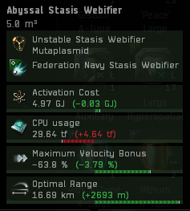

- Microwarpdrives, when it comes to your MWD speed is key. We all want to go faster, but it shouldnt come at the cost of fitting or capacitor use. An increase in speed can be the difference in those contests where we are on the limit. Try to upgrade your MWD last and find one that fits in with your other abyssal modules in regards to fitting. If you have plenty of fitting left you can afford to go with the CPU drop, but your priority should be speed > CPU > activation cost > signature radius. Webs should be 62% velocity bonus and 16km range to be eligible for web specialist badge.

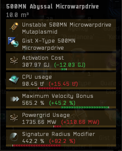

## Usefull Links

- [Best place to buy abyssals!](https://mutaplasmid.space/appraisal/)
- [Gank intel](https://eve-gatecheck.space/eve/)
- [Tool for people who sell their LP themselves](https://www.fuzzwork.co.uk/lpstore/)
- [Fit tool](https://github.com/pyfa-org/Pyfa/releases/)
- [Skill plan tool](https://github.com/peterhaneve/evemon/releases/)
- [Online market tool 1](https://evemarketer.com/)
- [Online market tool 2](https://market.fuzzwork.co.uk/type/)
- [Incursion rats](https://eve-incursions.de/rats)
- [Live DPS tracker](https://github.com/ArtificialQualia/PyEveLiveDPS)
- [Concord station locator](https://nearest.ouroborus.org/)
