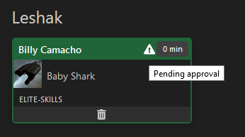
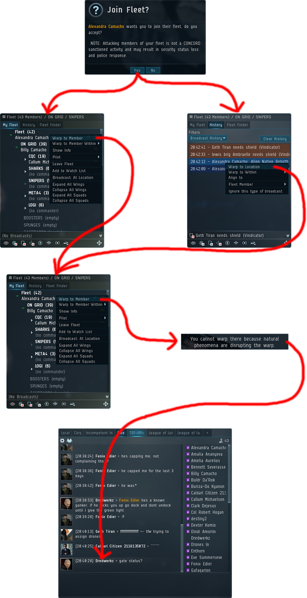
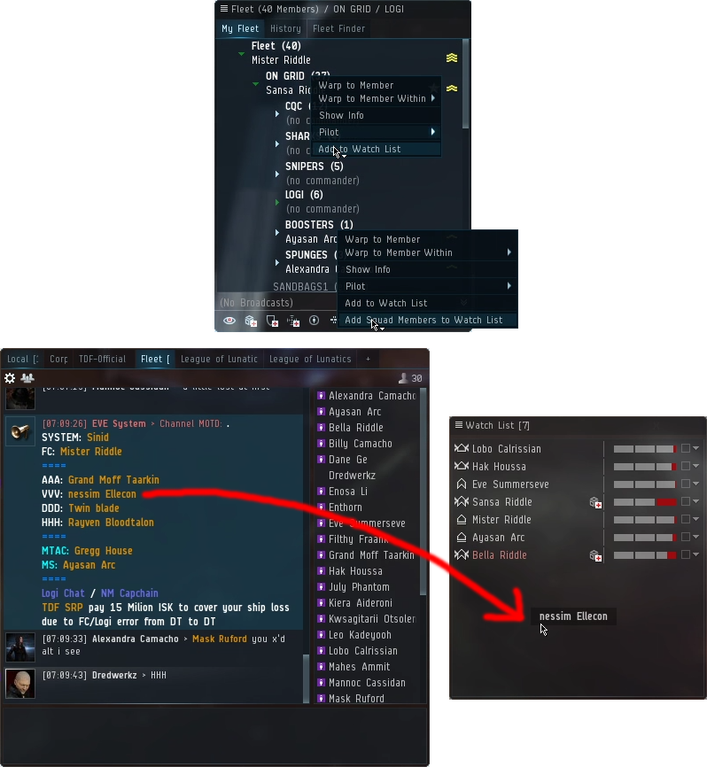
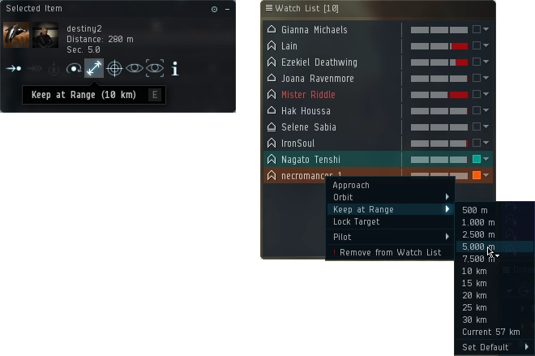
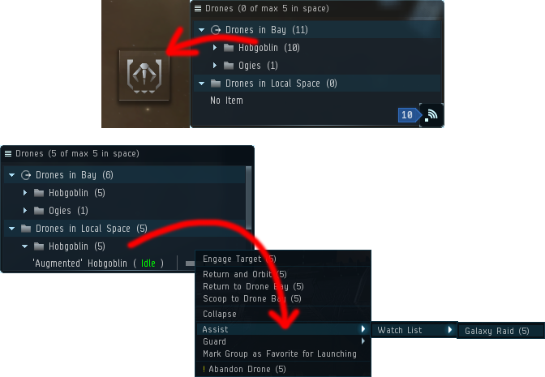
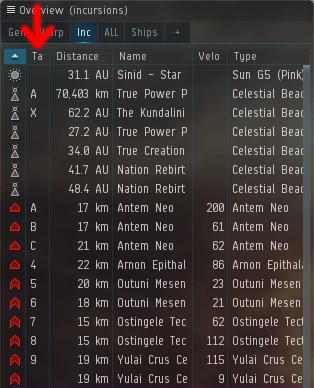
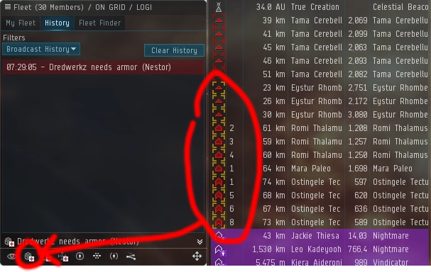

# First Fleet Guide

## Joining a TDF fleet

When the MOTD states that fleet is running, x-up on the [TDF WAITLIST](/) with your ship fitting, Join voice comms; [Teamspeak 3](https://www.teamspeak.com/en/) (server details are in **TDF-Official** MOTD) and wait for fleet invite.

## Using the Waitlist

Sign in on the waitlist with your eve account, login is done trough CCP, thus we have no acces to your EVE credentials. When the waitlist is open click on **Join Waitlist**. Copy paste your fit on the window and click **X-UP**.

**Fit Approval:** If your fit has an exclamation mark then there might be something wrong. Click on the ship picture To look for any warnings. Sometimes those warnings can be minimal and the FC might ignore it. (like missing a secondary drone) Click on the ship picture to inspect your fit and check what the issue is. A red warning will be given under your x-up box if you are required to fix something.

**Skills:** TDF will give out badges based on your progress. The **Basic skills** are the skills required to get out of the starter squad which is limited to 4 - 5 people in fleet. See the **Badges** section to know more about TDF's badges and progress system.

## Entering Grid

If this is your very first time in a TDF fleet make sure to notify the FC. He will usually help you! If not, once you have your fleet invite you can either join the fleet in the current site, by warping to the FC. Or wait at the next acceleration gate before the fleet arrives, by warping to the latest align to. If you are joining the fleet mid site, **you must warp to FC again**. If you are at the correct site you will be unable to warp and your ship will tell you it has natural phenomenon. If you warp to the latest align to broadcast, you must wait for the fleet to arrive. Once you are at the correct site, ask for gate status or wait for FC to call the gate status.

When you ask for gate status do not say the colors. There might be someone else waiting at a gate. If all they hear is "green." you might owe them a new ship.

**RED** = Do not use any acceleration gates.  
**GREEN** = Take the gate once you are sure you are at the correct site by warping to FC and you have natural phenomenon.

If you are unsure; **ALWAYS** warp to the FC, if you at the correct site you will not move, if you at the wrong site you will warp to the correct one.

## Ship Replacement Program

Paying 15M ISK to the TDF SRP corporation (a link is provided in the fleet MOTD) covers your ship until the next server downtime. Simply right click the corporation and "Give Money." The cover is for FC and logi error. You are not covered for your own mistakes. Be sure to broadcast on time and make sure you are in the right place in the right site. The payout is for everything destroyed if you die (up to 6Bn ISK). The fleet will pick up anything in your wreck and contract it to you. SRP is completely optional but strongly recommended.

## Watchlist

It's a good idea to have various fleet members on your watchlist. Starting with the FC, logi pilots, drone bunnies, your anchor, etc etc. This is not just to monitor their health status but is also useful for other things like, anchoring, finding your cap buddy quickly, or assigning drones more easily.

To add people to your watch list, either: -  
Right click them in the fleet window > add to watchlist  
Right click their name > Fleet > add to watchlist  
Drag their name from anywhere to the watchlist window.

## Anchors

Fleet anchors are the positions you need to move to, make sure to have them open and ready when first joining fleet! If this is your first time anchoring on another Vindi is tolerated if you are confused on where to go.

**Logi:** Cruisers will orbit a Nestor in the site to help speed tank.

**CQC & Snipers:** You will need to move your ship manually into position using Q to fly around. Open tactical camera with tactical overlay enabled. Hold Q to draw a line to where you want to go. First click will set the distance and the second will set the angle (Which is usually 0 thus you can double click.). Make sure to check out the anchoring guide!

If you happen to anchor on someone use the Keep at range function to keep your them at range. You want to be close so set this to 5000m, but if you are bumping the anchor because you cannot stop in time then increase the distance. You can right click people in your watchlist to keep them at range.

## Drones

To assign drones first you need to launch them. The simplest method is to drag the drones from the drone window into space. Then you can right click on the deployed group in the drone window, go to assist and click the name of the person that is your drone bunny.

Assignment order is as follows: -  
Light drones: DDD > Any vindicator  
Heavy Drones: HHH > HHH2 > Complain to FC

It's much easier to keep track of your drone bunny by adding them to your watchlist. When you right click to assist, there is a watch list sub menu.

## Tags

At minimum your overview should have an extra column displaying tags so the fleet can focus fire, or to indicate if a target is don't shoot. CQC use numbers, snipers use letters, and **if a target is tagged X you must not shoot it.** Some roles shoot targets in a different order, but normally shoot the targets in the order given by the tags.

## Danger Close

Before the Sansha shoot you they must first lock onto you. This is indicated by flashing yellow boxes around their icon in the overview. If you are yellow boxed you should **immediately broadcast** for armor using the button at the bottom of the fleet window. Once these indicators turn red, they are already trying to kill you. Being late can void your SRP.

## Disconnected

If you are disconnected you must not log back into the game. Depending on the site you may warp back into the site out of range of logi, or in some cases in a site when fleet has already exited. Join Teamspeak first and ask FC if you can log back in. Only if you get the ok then you can log back into eve. Once you are back in the game, open the **TDF-Official** channel and type "X DC \[Fleet Role\]" so the FC can reinvite you to the fleet.

## The Big Three

New players are obviously going to make mistakes. TDF won't crucify you for it. But you might get yourself killed if you're not careful. The three most common mistakes for new pilots are the following: -

**Taking gate too early.** You're not Leeroy Jenkins, you're not taking the site on by yourself so you don't need to be the first one in. Some sites even have delayed entry where a solo ship may take the gate up to 30 seconds before everyone else. He's fitted for it, you probably are not. This also happens sometimes on TCRC _exit._ People hear the TCRC warp out and think it is the warp in for the next site. It's better if you are late than early.

**Taking wrong gate.** Always have your fleet window open to broadcast history. You may get more than one warp to command, be ready to warp to the newest. If you hear over comms to bounce, this means all gates are RED and the fleet is warping to a new site. If you are ever unsure, warp to FC from the fleet window. No matter how many times you do this, you will only get phenomenon if you are at the correct site. You can even do this when using gates inside of sites.

**Being in the wrong place.** Your ship is probably pretty, but turn on tactical overlay and zoom out. If your ship is all alone, it's in the wrong place. It's also in the wrong place if there are lots of red dots and no purple ones. If that's the case, warp out, or you're going to die.

## Still not sure?

Just ask in fleet chat or over Teamspeak.
